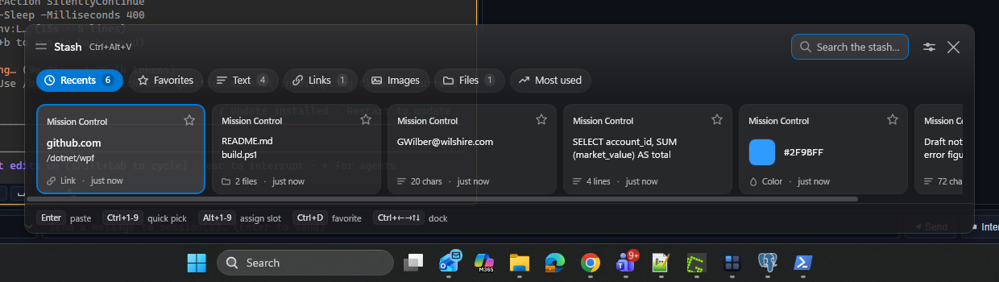
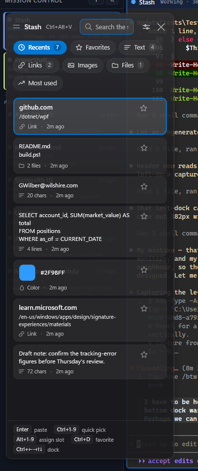
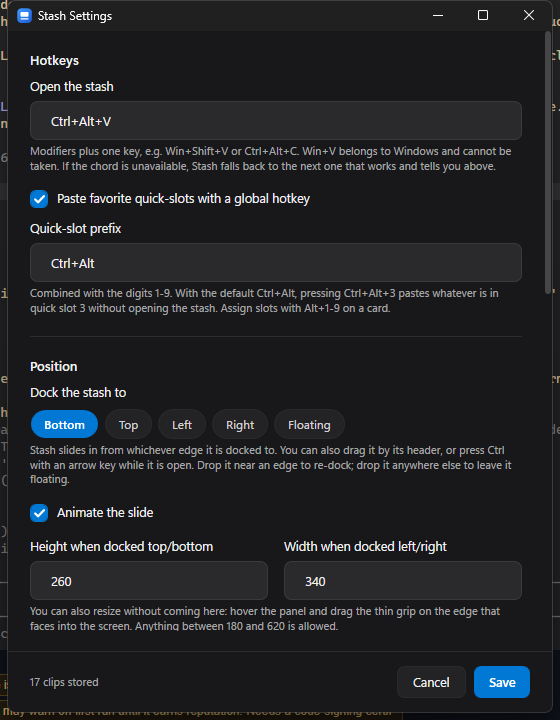

# Stash

A native Windows clipboard manager. Press a hotkey and a panel slides out from the
edge of the screen with everything you've copied recently, ready to grab.



## What it does

- **Remembers everything you copy** — text, links, images, files and colors, each
  rendered as the thing it actually is rather than a row of truncated text.
- **Opens on a hotkey** (`Ctrl+Alt+V` by default) and pastes straight back into
  the app you were in.
- **Docks to any edge** — bottom, top, left or right — and slides in from that
  edge. Drag it by its header to move it; drop it near an edge to re-dock, or
  anywhere else to leave it floating. `Ctrl` + an arrow key re-docks while open.
- **Resizes** by dragging the thin grip on the edge that faces into the screen,
  or by setting the size in Settings.
- **Views**: Recents, Favorites, Text, Links, Images, Files and Most used.
- **Favorites** you star are never evicted, and any favorite can be bound to a
  **quick slot 1–9** that pastes on a global hotkey without the panel appearing
  at all.
- **Type to filter** across content, source app and link text.
- **Macros** — hotkeys that *type* instead of pasting, for fields that reject
  pasted text, remote sessions with no shared clipboard, and form filling with
  real `Tab` presses. Record them by typing, or write them by hand.
- **Built-in help** on `F1` or the **?** button, explaining copying, pasting and
  every hotkey in plain language.
- Lives in the tray, starts at sign-in if you want it to, and follows your
  Windows light/dark theme and accent color.

Docked left, the strip becomes a column and the cards become rows:



Settings covers the hotkeys, docking and size, theme, retention limits and the
privacy controls:



## Install

Download or build `Stash-1.0.0.msi` and double-click it.

It is a **per-user install**: it goes into `%LOCALAPPDATA%\Programs\Stash`, needs
no administrator rights, never prompts for UAC, and makes no machine-wide
changes. That is a deliberate choice — Stash needs no elevation at runtime, and
on a managed desktop a per-machine installer is often the difference between
"installs" and "cannot install".

Silently, if you prefer:

```powershell
msiexec /i Stash-1.0.0.msi /qn      # install
msiexec /x Stash-1.0.0.msi /qn      # uninstall
```

Then press `Ctrl+Alt+V`. Stash also appears in Start and under Settings →
Installed apps.

Uninstalling removes the program but **keeps your clipboard history**, because
silently destroying it would be the wrong default. To remove that too, delete
`%LOCALAPPDATA%\Stash`.

### Requirements

- Windows 10 2004 or later (built and tested on Windows 11)
- [.NET 10 desktop runtime](https://dotnet.microsoft.com/download/dotnet/10.0) —
  the shipped exe is framework-dependent so it stays under a megabyte

## Build

```powershell
powershell -ExecutionPolicy Bypass -File build.ps1            # dist\Stash.exe
powershell -ExecutionPolicy Bypass -File build.ps1 -Installer # ...and the .msi
```

`build.ps1` finds the SDK on `PATH` or in your user profile. Add
`-SelfContained` for an exe that runs without .NET installed, or `-Icon` to
regenerate the app icon from `tools\New-StashIcon.ps1`.

Building needs the .NET 10 SDK. With no admin rights it installs cleanly into
your user profile:

```powershell
& ([scriptblock]::Create((irm https://dot.net/v1/dotnet-install.ps1))) -Channel 10.0 -InstallDir "$env:LOCALAPPDATA\dotnet"
```

Building the installer additionally needs WiX, also per-user:

```powershell
dotnet tool install --global wix --version 5.0.2
wix extension add --global WixToolset.UI.wixext/5.0.2
wix extension add --global WixToolset.Util.wixext/5.0.2
```

> WiX is pinned to **5.0.2** on purpose. WiX 6 and 7 require accepting the Open
> Source Maintenance Fee licence, which is a paid commercial agreement. Version 5
> is the last freely licensed release. Don't casually bump this — it's a
> procurement decision, not a version bump.

## Keyboard

| Key | Action |
| --- | --- |
| `Ctrl+Alt+V` | Open or dismiss Stash |
| Type anything | Filter |
| `←` `→` `↑` `↓` | Move between cards |
| `Enter` | Paste the selected card |
| `Ctrl`+`1`–`9` | Paste the Nth visible card |
| `Alt`+`1`–`9` | Assign the selected card to that quick slot |
| `Ctrl+Alt`+`1`–`9` | Paste quick slot N from anywhere, without opening Stash |
| `Ctrl+D` | Star / unstar |
| `Tab` / `Shift+Tab` | Cycle views |
| `Alt+C` | Copy without pasting |
| `Alt+O` | Open a link, reveal a file, or open an image |
| `Alt+Delete` | Remove from history |
| `Ctrl` + arrow | Re-dock to that edge |
| `Ctrl+,` | Settings |
| `F1` | How to use Stash |
| `Esc` | Dismiss |

Macros get their own chords, whatever you assign them — see [Macros](#macros).
`Ctrl+Alt+Shift+R` stops a recording.

There's a built-in guide covering all of this — press `F1`, click the **?** in the
panel header, or pick "How to use Stash" from the tray menu. It reads the chords
out of your actual configuration, so it shows the hotkey you really have rather
than the default (they differ if the preferred chord was already taken).

Card actions use `Ctrl`/`Alt` chords rather than bare letters because the search
box always holds focus, so plain keys have to stay available for typing.

## Macros

A quick slot pastes through the clipboard. A **macro** presses the keys itself,
which matters when pasting isn't an option: fields that reject pasted text,
remote or virtualised sessions where the clipboard isn't shared, and forms that
need a real `Tab` between fields. It also leaves your clipboard untouched.

**Record one:** Settings → *Record a macro*. Press Start, switch to the app you
want, and type. Stash collects letters into text runs and turns keys like `Tab`,
`Enter` and `Backspace` into steps of their own. `Ctrl+Alt+Shift+R` stops the
recording; then name it, give it a hotkey, and save.

**Manage them:** Settings lists every macro in the file — including disabled and
broken ones, so they can be fixed rather than just ignored. Each row has a tick
to enable or disable it, a pencil to edit the name, hotkey or steps, and a bin to
delete it. Changes take effect immediately; no restart, no reload.

Editing opens the same recorder. Change the name or hotkey and save, and the
steps are left alone; press *Record again* to replace what it types. An existing
macro is never emptied by starting and stopping a recording that captured
nothing.

**Or write one:** macros live in `%LOCALAPPDATA%\Stash\macros.json`, which Stash
seeds with worked examples on first run. Each step is text to type, a key to
press, or a pause:

```json
{
  "Macros": [
    {
      "Name": "Example",
      "Hotkey": "Ctrl+Alt+H",
      "Enabled": true,
      "Steps": [ { "Text": "EXAMPLE" } ]
    },
    {
      "Name": "Fill two fields",
      "Hotkey": "Ctrl+Alt+J",
      "Enabled": true,
      "Steps": [
        { "Text": "first field" },
        { "Key": "Tab" },
        { "DelayMs": 100 },
        { "Text": "second field" },
        { "Key": "Enter" }
      ]
    }
  ]
}
```

`Key` accepts `Tab`, `Enter`, `Esc`, `Backspace`, `Delete`, `Home`, `End`,
arrows, `F1`–`F24`, and chords like `Ctrl+A`. Save the file, then Settings →
*Reload macros* (or the tray menu).

Text is typed with `KEYEVENTF_UNICODE` rather than virtual-key codes, so it is
independent of keyboard layout and handles characters that have no key of their
own. If a stubborn target drops characters — remote desktop clients are the usual
culprits — raise **typing pace** in Settings from 0 to 5–15 ms.

### Two things to know

**Recording uses a low-level keyboard hook**, the same mechanism a keylogger
uses. It is therefore installed *only* between pressing Start and stopping, never
while Stash merely sits in the tray; it ignores synthetic input, so macros can't
record each other; and captured keys exist only in memory until you save. While a
recording is running it does see everything you type.

**Macros are stored as plain text and type whatever they contain.** Don't put
passwords in them — leave those in your password manager, which Stash already
declines to record.

## Privacy

A clipboard manager sees everything you copy, so it's worth being precise about
what this one does:

- **Everything stays local.** Stash makes no network calls of any kind. History
  lives in `%LOCALAPPDATA%\Stash` and nothing leaves the machine.
- **Sensitive clips are skipped.** Password managers and browsers tag a copy with
  the `ExcludeClipboardContentFromMonitorProcessing` and
  `CanIncludeInClipboardHistory` clipboard formats to opt out of history. Stash
  honors both, and treats an unreadable flag as an opt-out rather than guessing.
  Both paths are covered by tests.
- **Per-app blocklist.** Copies made while a listed app is in front are never
  stored. The common password managers are on the list by default; add your own
  in Settings.
- **Limits.** 400 clips and 30 days by default, both adjustable. Favorites are
  exempt from eviction.

**The one real limitation to be aware of:** history is stored as plain files and
**is not encrypted at rest**. Anything that can already read your user profile
can read your clipboard history. That's the same exposure as Windows' own
clipboard history, but it's a deliberate trade rather than an oversight — treat
the store as readable, and use the blocklist for anything that matters. If you
handle material non-public or client data, check this against your own
organization's data-handling policy before leaving it running.

You can clear history from the tray menu or Settings at any time.

## How it's built

WPF on .NET 10, with **no NuGet dependencies at all** — the only non-framework
references are `NotifyIcon` and GDI+ for the tray, which come from the Windows
Desktop framework. Storage is a JSON index plus PNG files, which keeps startup
instant at the few-hundred-clip scale it's designed for.

```
src/Stash/
  Interop/     P/Invoke, global hotkeys, clipboard listener, DWM, monitor geometry
  Models/      ClipItem, AppSettings, DockEdge, StashView
  Services/    capture, history, paste, placement, theme, thumbnails
  ViewModels/  panel and card state
  Views/       the main window, settings, tray icon
  Theme/       palettes, control styles, hand-authored vector icons
installer/     WiX source for the per-user MSI
tools/         icon generator
tests/         integration tests
```

Four decisions worth knowing about, because they're not obvious and they are
load-bearing:

**The window is bigger than the panel.** The extra room on the docked side is the
distance the panel slides through, and it hangs off the edge of the screen where
it can't be seen. That lets the slide be a GPU transform on the content instead of
moving the window every frame, which judders. The window is clipped to its own
monitor so the overhang can't appear on the display next door — which is why a
left-docked panel legitimately occupies a window spanning two monitors while
painting on only one.

**Placement goes through `SetWindowPos` in physical pixels, not `Window.Left`.**
On a desktop mixing DPI scales there is no single device-independent coordinate
space covering every monitor, so setting `Left` in WPF units puts the window on
the wrong display at the wrong size. This was a real bug found by testing on a
200% display next to two 100% displays; `tests/Test-Placement.ps1` now guards it.

**Real acrylic and a real slide are mutually exclusive in WPF.** The DWM backdrop
needs an opaque-framed window, which would clip the sliding panel. Stash takes the
slide and paints its own translucent material with a drop shadow. The settings
window, which doesn't slide, does use the DWM dark title bar and rounded corners.

**Icons are hand-authored vector paths, not an icon font.** Segoe Fluent Icons
codepoints sit in the private-use area and move between Windows releases; one
early build silently rendered every chip icon as blank.

## Tests

```powershell
powershell -ExecutionPolicy Bypass -File tests\Run-Tests.ps1
```

These are integration tests, not unit tests, and that's deliberate: nearly
everything worth verifying here lives where a unit test can't reach — global
hotkey registration, focus hand-off between processes, synthetic `Ctrl+V`, and
window placement across mixed-DPI monitors. They drive the real app with
synthesized keystrokes and read results back from a live text box and the on-disk
history.

So they need an interactive desktop, they can't run headless or in CI, and they
take over the keyboard for a few seconds — don't type while they run. They also
reset your local history and settings so card positions are deterministic; pass
`-KeepProfile` to keep them.

43 assertions across five suites:

| Suite | What it checks |
| --- | --- |
| `Test-ContentTypes` | Every kind Stash handles — plain text, multi-line text, links, colors, images and file lists — is captured with the right kind and metadata, **and** puts the original payload back on the clipboard when selected. Also asserts that clips flagged `ExcludeClipboardContentFromMonitorProcessing` or `CanIncludeInClipboardHistory=0` are never stored. |
| `Test-Paste` | Hotkey opens the panel, arrow keys navigate, `Enter` pastes the selected clip into the app that had focus, `Ctrl+1` quick-picks, `Esc` dismisses without pasting. |
| `Test-QuickSlots` | `Alt+1` assigns a quick slot, a slotted clip becomes a favorite, and `Ctrl+Alt+1` pastes it globally without opening the panel. |
| `Test-Macros` | A macro hotkey types plain text, punctuation and mixed case; `Enter`, `Tab` and `Backspace` replay as real key presses; a disabled macro stays silent; and typing a macro leaves the clipboard untouched. It writes its own `macros.json` fixture and restores yours afterwards. |
| `Test-Placement` | All four dock edges on every connected monitor — 12 checks here — land inside the work area at the right offset and centring, including mixed DPI. Expected geometry is derived from the measured window, not read back from settings, so changing a default size can't silently invalidate the test. |

Round-trip checks use `Alt+C` (copy without pasting) rather than `Enter`, because
"paste into a text box" is meaningless for an image or a file list; reading the
clipboard back afterwards verifies the real payload uniformly for every kind.

The installer was verified end to end by hand: silent install, launch, uninstall
while running (the running instance is closed automatically), a clean upgrade from
1.0.0 to 1.0.1 leaving a single entry, and confirmation that clipboard history
survives uninstall. That cycle is not automated.

## Known gaps

Honest list of what isn't there:

- No rich-text or HTML preservation — clips paste as plain text, images as images.
  The formats are read but only the plain payload is stored.
- No sync, no history across machines. Local only, by design.
- The hotkey is a single chord; there's no per-app or context-sensitive behavior.
- Search is substring matching, not fuzzy.
- The MSI is unsigned. Windows SmartScreen may warn on first run until it builds
  reputation. Signing needs a code-signing certificate.
- The installer cycle is manual, not covered by `Run-Tests.ps1`.
- Untested on a single-monitor machine and on Windows 10 specifically, since the
  development machine is a three-monitor Windows 11 setup. The mixed-DPI paths are
  the ones most likely to hide a surprise elsewhere.
